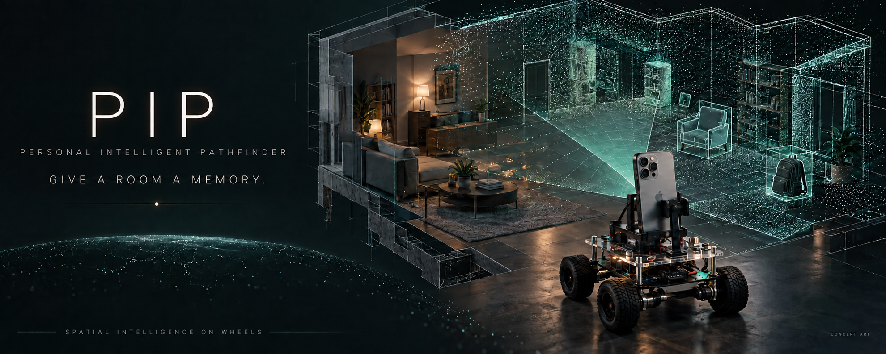
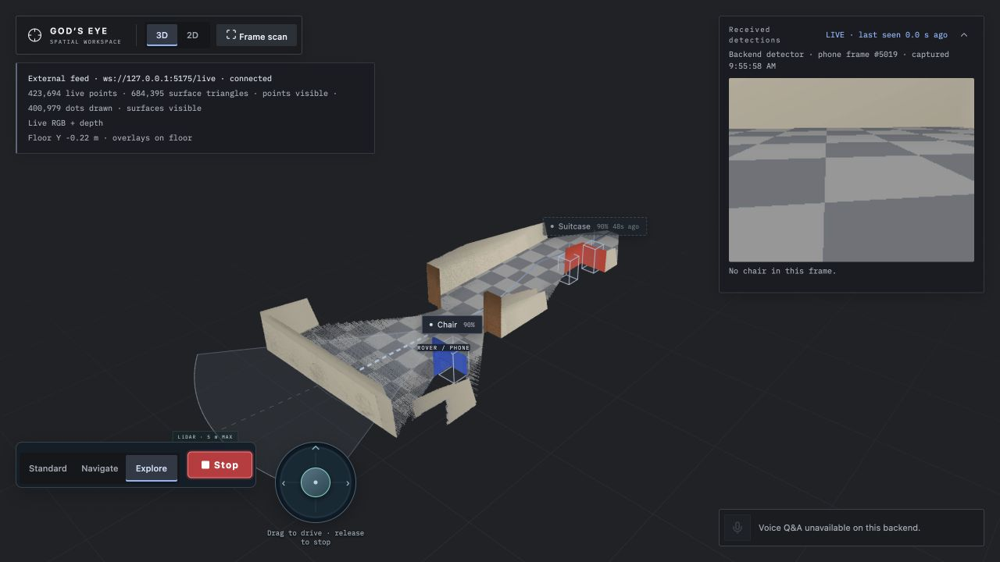
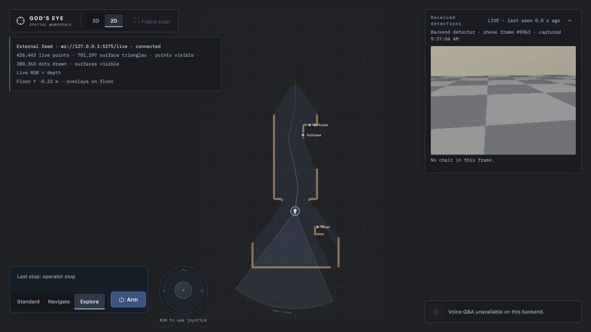

<p align="center">
  
</p>

<h1 align="center">PIP — Personal Intelligent Pathfinder</h1>

<p align="center">
  <strong>Give a rover eyes. Give a room a memory.</strong><br />
  An iPhone. A rover. A live, queryable 3D world.<br />
  PIP turns camera, LiDAR, and motion into a spatial workspace you can explore, inspect, and talk to.
</p>

<p align="center">
  <a href="#boot-mission-control">Run the demo</a> ·
  <a href="#what-you-can-do">Capabilities</a> ·
  <a href="#meet-scout">Meet Scout</a> ·
  <a href="#the-whole-machine">Architecture</a> ·
  <a href="#put-it-on-wheels">Connect a rover</a> ·
  <a href="#inside-the-repo">Docs</a>
</p>

<p align="center"><sub>Hero image: AI-generated concept art. Dashboard images below: actual application, simulated sensor data.</sub></p>

---

**The room is the interface. Scout is your rover.**

Mount a LiDAR-equipped iPhone on a small rover. Stream its view to a laptop. Watch observed surfaces accumulate into a colored 3D map, objects acquire positions and histories, and a dashboard become mission control for the space around you.

Then ask Scout what it has seen. Focus on an object. Inspect what changed. Pick a destination on the map, or ask for one by name and review the proposed route.

**See the space. Remember the details. Decide where to go next.**

PIP is a hackathon robotics project with a full stack behind the ambition: a native sensor app, a perception and planning backend, a spatial dashboard, and an opt-in rover relay. The software and simulator are here. Physical autonomy is an experimental prototype with short supervised runs; [hardware status](#from-prototype-to-physical-world) is documented below.

## Mission control, on your laptop



*The real dashboard receiving RGB-D observations from the SIMULATED rover. The scene is synthetic; mapping, reconstruction, object localization, and the interface run through the application. These screenshots were captured before the PIP rename and show the original God's Eye branding.*



*One world, two perspectives: inspect the scan in 3D, then switch to the top-down map for spatial context and navigation.*

## What you can do

| Capability | What it looks like |
| --- | --- |
| **Build a world as you move** | Stream synchronized RGB, LiDAR depth, confidence, and camera pose from a native SwiftUI/ARKit app. Watch a colored surface map and point cloud grow in the browser. |
| **Keep a spatial memory** | Give detected objects a place in the map, observation history, confidence, and last-seen state. Revisit the evidence after the camera looks elsewhere. Detection requires a configured detector. |
| **Notice what changed** | Save a rescan baseline and compare fresh observations against it. Changes become events; a missing view alone does not prove an object disappeared. |
| **Talk to your scout** | Ask spoken questions grounded in observed objects and changes, focus the view, or request a destination. Optional Gemini and ElevenLabs integrations add scene reasoning and spoken answers. |
| **Point to the next destination** | Click mapped floor or a scanned thing to request a reachable approach. Inspect occupancy and routes in 2D, then return to the 3D scene. Execution depends on backend readiness and explicit arming. |
| **Explore with an operator in control** | Frontier-based planning, obstacle replanning, stationary scan checkpoints, joystick and keyboard takeover, and explicit Arm/Stop controls connect through the configured rover adapter. |
| **Rehearse the whole loop** | Run a synthetic corridor through the real backend and dashboard, including mapping, planning, object localization, and the rover command protocol. No phone, motors, model weights, or API keys required. |

### A map with a memory

The dashboard keeps observed colored geometry as you move, with a **1,000,000-triangle surface budget** and a **2,000,000-point cache**. It compresses suitable planar regions to make room for more coverage, retains recent image detail, and uses fresh depth evidence to retire stale geometry.

Switch between 3D reconstruction and top-down occupancy. Select an object to inspect its evidence. Open Spatial Memory, Object Intelligence, and Recent Activity without leaving the map. Export the accumulated view before reloading.

Those numbers are memory budgets, not measured throughput claims. Reconstruction preserves gaps where observations are missing; it is a live RGB-D map, not a guaranteed complete or watertight model. [How the viewer works →](dashboard/VIEWER.md)

## Meet Scout

Scout is PIP’s rover, and **Ask Scout** is its voice interface to the map. With the optional providers configured, try questions and requests like:

> “What have you seen?”<br />
> “Show me the chairs.”<br />
> “What changed?”<br />
> “Go to the doorway on the left.”

**Listen → ground in scene evidence → answer → speak.** ElevenLabs handles speech recognition and synthesis; Gemini handles grounded answers, optional crop labels, and named-landmark lookup. A landmark request searches selected camera views retained for map coverage, then uses their measured depth to propose an approach point when the evidence supports one.

Movement suggestions appear as confirmation cards. Review the route, satisfy the readiness and arming checks, then confirm by click or a spoken **“go.”** A spoken **“stop”** runs the operator Stop immediately. The model cannot independently arm or drive the rover.

Voice and cloud labeling are off by default and require provider credentials and explicit opt-in. The simulator does not configure voice. [Voice setup](backend/VOICE.md) · [Navigation proposals](backend/NAV_ACTIONS.md)

## The whole machine

From photons to point clouds to a proposed path. This is the system map: sensing, perception, memory, reconstruction, language, planning, and the separately enabled physical control loop.

**[Open the full-size architecture map →](docs/assets/architecture.svg)**

**Solid arrows** show data and application flow. **Dashed arrows** show optional integrations, alternate inputs, or the hardware path. Every motion path still passes through operator intent and backend readiness checks.

```mermaid
flowchart TB
    subgraph WORLD["01 / THE WORLD"]
        direction LR
        Room["Rooms · corridors · doorways"]
        Things["Objects · people · changes"]
        Operator["Human operator"]
    end

    subgraph PHONE["02 / THE SENSOR RIG — SwiftUI + ARKit"]
        direction LR
        Camera["Rear camera<br/>RGB + calibration"]
        Depth["LiDAR scene depth<br/>Raw + smoothed + confidence"]
        Tracking["Camera pose<br/>Tracking state + timestamps"]
        Geometry["ARKit geometry<br/>Floor anchors + scene mesh"]
        Frame["One synchronized observation<br/>Same frame · session · map epoch"]
        Capture["Full sensor capture<br/>Images · motion · geometry · telemetry"]
        PhoneArchive[("On-device capture archive")]
    end

    subgraph CORE["03 / PERCEPTION + SPATIAL MEMORY — Python + FastAPI"]
        direction TB
        Intake["Phone ingest<br/>Validate identity · geometry · freshness"]
        Map["Depth projection<br/>Camera pixels → world coordinates"]
        Points["Colored map points<br/>Voxel deduplication + bounded delivery"]
        Occupancy["Navigation occupancy<br/>Free · occupied · unknown"]
        Detector["Configured detector<br/>Image boxes + classes"]
        Localize["Depth localization<br/>Detections → measured 3D positions"]
        Memory["Object memory<br/>Observations · confidence · last seen"]
        Changes["Rescan + change evidence<br/>Baseline compared with fresh observations"]
        DB[("SQLite<br/>Sessions · objects · events · metadata")]
        CaptureStore[("Separate capture recordings<br/>Full sensor packets")]
        Views["Coverage-kept camera views<br/>Bounded RGB-D landmark memory"]
    end

    subgraph VIEWER["04 / MISSION CONTROL — React + Three.js"]
        direction TB
        Live["Live feed<br/>Points · pose · objects · occupancy · events"]
        RGBD["Calibrated RGB-D bundles<br/>Native image + depth"]
        Surface["Surface reconstruction worker<br/>Observed geometry + planar compression"]
        Scene["Persistent colored 3D workspace<br/>Surface map + point cloud"]
        TopDown["2D map<br/>Occupancy + destinations + routes"]
        Evidence["Spatial memory + object intelligence<br/>Evidence · history · recent activity"]
        Controls["Operator controls<br/>Arm · Stop · Standard · Explore · joystick"]
        Export["Export observed geometry<br/>View snapshots + bounded state"]
    end

    subgraph VOICE["05 / SCOUT — OPTIONAL VOICE + GEMINI"]
        direction TB
        Mic["Ask Scout<br/>Click-to-talk"]
        STT["ElevenLabs<br/>Speech to text"]
        Ground["Grounded context<br/>Observed objects · changes · live state"]
        Gemini["Gemini<br/>Scene answers + allowlisted suggestions"]
        Landmark["Named-landmark lookup<br/>Selected views + measured depth"]
        Crop["Optional Gemini crop labels<br/>Saved-object enrichment"]
        UIAction["Validated dashboard action<br/>Focus · filter · inspect · change view"]
        Card["Single-use movement proposal<br/>Route preview + readiness + expiry"]
        Confirm["Human confirmation<br/>Click or spoken go"]
        SpokenStop["Spoken stop<br/>Immediate operator Stop"]
        TTS["ElevenLabs<br/>Spoken answer or confirmed result"]
    end

    subgraph NAV["06 / NAVIGATION — LAPTOP OWNED"]
        direction TB
        Goal["Mapped destination<br/>Point or reachable object approach"]
        Explore["Explore<br/>Frontier selection + scan checkpoints"]
        Ready["Motion readiness<br/>Map · pose · floor · adapter · configured profile"]
        Planner["Path planning<br/>Clearance + occupancy + replanning"]
        Follow["Navigator<br/>Follow path · react to new evidence"]
        Manual["Standard manual input<br/>Joystick · keys · confirmed bounded move"]
        Gate["Command validation<br/>Explicit arm · freshness · bounded motion"]
        Stop["Stop / disarm<br/>Operator request or invalid control state"]
    end

    subgraph DRIVE["07 / PHYSICAL CONTROL — SEPARATELY CONFIGURED"]
        direction TB
        Adapter{"Selected car adapter"}
        Logging["Default: logging only<br/>Car down · hardware motion unavailable"]
        Relay["Opt-in authenticated rover relay<br/>Session + sequence + fresh ESP permit"]
        PhoneBLE["iPhone control relay<br/>Sensing checks + Bluetooth owner"]
        ESP["ESP32-S3 bridge<br/>Permit gate + session checks + watchdog"]
        Uno["Arduino Uno<br/>Motor commands + timed-command stop"]
        Rover["ELEGOO V4<br/>Physical movement"]
    end

    subgraph LAB["08 / THE HARDWARE-FREE LAB"]
        direction LR
        Sim["SIMULATED rover<br/>Ray-cast RGB-D + synthetic motor response"]
        Fake["Synthetic phone / live feeds<br/>Deterministic protocol fixtures"]
        Replay["Offline navigation-log replay<br/>Recorded pose + occupancy → planner decisions"]
        Tests["Regression suites<br/>Backend · dashboard · Swift · firmware"]
    end

    Room --> Camera
    Room --> Depth
    Things --> Camera
    Camera --> Frame
    Depth --> Frame
    Tracking --> Frame
    Geometry --> Frame
    Frame -->|"Wi-Fi /phone"| Intake
    Frame --> Capture
    Capture --> PhoneArchive
    Capture -->|"Separate full-sensor upload"| CaptureStore

    Intake --> Map
    Map --> Points
    Map --> Occupancy
    Intake --> Detector
    Detector --> Localize
    Map --> Localize
    Localize --> Memory
    Memory --> Changes
    Map -->|"Fresh depth evidence"| Changes
    Memory --> DB
    Changes --> DB
    Intake -.->|"Voice enabled"| Views

    Points --> Live
    Occupancy --> Live
    Memory --> Live
    Changes --> Live
    Tracking -->|"Accepted pose via backend"| Live
    Intake --> RGBD
    RGBD --> Surface
    Surface --> Scene
    Live --> Scene
    Live --> TopDown
    Live --> Evidence
    Scene --> Export
    Operator --> Controls
    Operator --> Mic

    Mic -.-> STT
    STT -.-> Gemini
    STT -.-> SpokenStop
    Memory -.-> Ground
    Changes -.-> Ground
    Ground -.-> Gemini
    Localize -.-> Crop
    Gemini -.-> UIAction
    UIAction -.-> Evidence
    UIAction -.-> Scene
    Gemini -.-> Card
    Gemini -.-> Landmark
    Views -.-> Landmark
    Landmark -.-> Card
    Card --> Confirm
    Operator --> Confirm
    STT -.->|"Go on one live card"| Confirm
    Gemini -.->|"Answer"| TTS
    UIAction -.->|"Applied result"| TTS
    Card -.->|"Readiness result"| TTS

    Scene -->|"Click-to-approach"| Goal
    TopDown -->|"Pick mapped destination"| Goal
    Confirm -->|"Confirmed destination"| Goal
    Confirm -->|"Confirmed exploration"| Explore
    Confirm -->|"Confirmed bounded move"| Manual
    Controls --> Ready
    Controls --> Explore
    Controls --> Manual
    Controls --> Stop
    SpokenStop --> Stop
    Occupancy --> Ready
    Ready --> Planner
    Goal --> Planner
    Explore --> Planner
    Occupancy --> Planner
    Planner --> Follow
    Follow --> Gate
    Manual --> Gate
    Ready --> Gate
    Gate --> Adapter
    Stop --> Adapter

    Adapter --> Logging
    Adapter -.-> Relay
    Relay -.-> PhoneBLE
    PhoneBLE -.-> ESP
    ESP -.-> Uno
    Uno -.-> Rover

    Sim -.->|"Simulated phone packets"| Intake
    Sim -.->|"Simulated rover feedback"| Relay
    Fake -.-> Intake
    Fake -.-> Live
    Replay -.-> Planner
    Tests -.-> Intake
    Tests -.-> Gate

    classDef sensor fill:#12323a,stroke:#62d9cb,color:#e5faf5
    classDef memory fill:#17303f,stroke:#73b8df,color:#eaf7ff
    classDef viewer fill:#173b32,stroke:#82d8af,color:#e9fff2
    classDef voice fill:#302440,stroke:#b8a0e6,color:#f5edff
    classDef nav fill:#3b321c,stroke:#d9bc73,color:#fff5dc
    classDef stop fill:#40292b,stroke:#e59494,color:#fff0f0
    classDef lab fill:#29313b,stroke:#a4b4c7,color:#f0f5fa
    class Camera,Depth,Tracking,Geometry,Frame,Capture,PhoneArchive sensor
    class Intake,Map,Points,Occupancy,Detector,Localize,Memory,Changes,DB,CaptureStore,Views memory
    class Live,RGBD,Surface,Scene,TopDown,Evidence,Controls,Export viewer
    class Mic,STT,Ground,Gemini,Landmark,Crop,UIAction,Card,Confirm,TTS voice
    class Goal,Explore,Ready,Planner,Follow,Manual,Gate,Adapter,Relay,PhoneBLE,ESP,Uno,Rover nav
    class Stop,SpokenStop,Logging stop
    class Sim,Fake,Replay,Tests lab
```



The phone supplies the observations. The laptop owns perception, memory, and planning. The browser gives the operator a view into both. With the hardware relay enabled, the phone also owns the Bluetooth connection to the rover.

The [wire contract](docs/INTERFACES.md) defines message formats and coordinates. The [autonomy guide](docs/AUTONOMY.md) defines the physical control path and its readiness requirements.

## Boot mission control

**Start with the simulator.** It runs the real application against a clearly labeled **SIMULATED** world, with a corridor, obstacles, a doorway, and a chair-like object to discover.

You need **Python 3.10+**, **Node.js 22+**, and npm. From a fresh checkout:

```sh
git clone https://github.com/azizu06/godseye.git
cd godseye

python3 -m venv .venv
.venv/bin/python -m pip install -r backend/requirements-test.txt -r tools/requirements.txt
npm --prefix dashboard ci

.venv/bin/python -m tools.sim_rover --dashboard
```

Open **[mission control at localhost:5175](http://127.0.0.1:5175/)**. The simulated backend runs on `127.0.0.1:8775`; its [health](http://127.0.0.1:8775/health) and [API docs](http://127.0.0.1:8775/docs) are available there. These ports keep the rehearsal separate from the usual physical-demo ports.

1. **Watch the map arrive.** The synthetic phone streams camera poses and RGB-D frames into the real mapping pipeline.
2. **Open the workspace.** Press **Escape** for scene settings, connection settings, spatial memory, and rover controls.
3. **Try the mission flow.** Select Explore and explicitly Arm the simulated rover. Use Standard for manual control or Navigate for mapped destinations. Readiness checks remain part of the flow.
4. **Inspect the result.** Switch between 2D and 3D, select objects, frame the scan, and try Stop.
5. **Shut down.** Press **Ctrl-C** in the launching terminal to stop the simulator, backend, and dashboard.

The world, detections, and motor response are synthetic. The simulator does not reproduce Bluetooth timing, wheel slip, ARKit drift, or LiDAR noise, and its dimensions and speed model are not calibration for a real rover. [Simulator details →](tools/README.md#simulated-rover-dashboard-rehearsal-no-phone-or-car)

<details>
<summary><strong>Prefer the minimal sensor-stream demo?</strong></summary>

After installing the dependencies above, start the default backend from the repository root:

```sh
.venv/bin/python -m uvicorn backend.app:app --host 127.0.0.1 --port 8765 --ws-max-size 8388608
```

In a second terminal, send synthetic phone frames:

```sh
.venv/bin/python tools/fake_phone.py --url ws://127.0.0.1:8765/phone
```

In a third terminal, start the dashboard:

```sh
npm --prefix dashboard run dev
```

Open [localhost:5173](http://localhost:5173/). The dashboard defaults to the backend on port 8765. This stream provides synthetic pose and depth points; it does not provide the simulator's navigable world or configured detector. The default car adapter stays down and only logs commands. Keep the development backend on a trusted local network.

</details>

## Put it on wheels

| Hardware | Job |
| --- | --- |
| **LiDAR-equipped iPhone Pro, iOS 16+** | Rear camera, scene depth, confidence, camera tracking, and the native capture app. |
| **Laptop** | Python perception and planning backend, local storage, and browser dashboard. |
| **ELEGOO V4 rover with Uno and ESP32-S3 bridge** | Mobile platform, motor control, and the project's Bluetooth firmware. |
| **Fixed phone mount and a private network** | A stable camera-to-rover relationship and a connection between the phone and laptop. |

Start with [iPhone capture](ios/README.md) to get a real room into the map. Follow [manual rover setup](ios/ROVER.md) for the independent phone remote, then [autonomy integration](docs/AUTONOMY.md) for laptop-directed motion and the required profiles.

### From prototype to physical world

The project has crossed the gap from synthetic packets to real hardware: the iPhone-to-ESP32-S3-to-Uno Bluetooth link, manual movement, and simultaneous RGB-D streaming are verified in the project docs. A short supervised prototype Explore run followed a laptop-planned route, recorded approximately **0.243 m of ARKit position change**, and stopped when the updated map reported a blocked path. Explicit Stop was acknowledged. [Recorded evidence →](docs/AUTONOMY.md#current-evidence)

That is an early physical milestone. Sustained autonomous navigation and measured motion calibration remain unfinished.

**The ordinary backend uses a logging-only adapter and cannot arm or drive hardware.** The separate opt-in relay requires explicit setup and arming. The measured path needs real geometry and actuation profiles; the documented uncalibrated prototype uses operator-supplied estimates. Simulation values must never stand in for physical measurements.

## Inside the repo

| Area | Stack | Start here |
| --- | --- | --- |
| **Sensor app** | Swift · SwiftUI · ARKit | [iPhone setup](ios/README.md) · [Full sensor capture](docs/CAPTURE.md) |
| **Perception and memory** | Python · FastAPI · NumPy · SQLite | [Backend](backend/README.md) · [Detection](backend/DETECTION.md) |
| **Spatial workspace** | TypeScript · React · Three.js · React Three Fiber · Vite | [Dashboard](dashboard/README.md) · [Viewer](dashboard/VIEWER.md) · [Persistent reconstruction](dashboard/PERSISTENT_SCAN.md) |
| **Scene intelligence** | Gemini · ElevenLabs, optional | [Voice](backend/VOICE.md) · [Confirmed navigation](backend/NAV_ACTIONS.md) · [Spoken change events](backend/AUDIO.md) |
| **Rover control** | Python planning · Swift relay · ESP32-S3 firmware · Uno | [Autonomy](docs/AUTONOMY.md) · [Manual control](ios/ROVER.md) · [Firmware](firmware/elegoo-ble/README.md) |
| **Simulation and replay** | Synthetic sensor streams · protocol rehearsal · offline planner replay | [Developer tools](tools/README.md) |
| **Shared interfaces** | Versioned sensor and live-view messages | [Authoritative wire contract](docs/INTERFACES.md) |

## The receipts

The repo includes hardware-free tests for mapping, object memory, navigation, relay behavior, and dashboard rendering, plus Swift sensor/relay checks and firmware protocol tests.

With the quick-start dependencies installed, run from the repository root:

```sh
# Backend and tooling
.venv/bin/python -m unittest discover -s backend/tests
.venv/bin/python -m unittest discover -s tools/tests

# Synthetic sensor-to-map and navigation smoke
.venv/bin/python -m tools.car_smoke

# Dashboard unit tests and production build
npm --prefix dashboard test
npm --prefix dashboard run build
```

Browser regressions, Swift validation, and firmware checks have additional setup in the [dashboard](dashboard/README.md#verify), [iPhone](ios/README.md#validation), and [autonomy](docs/AUTONOMY.md#validation) guides. Hardware-free passes validate software behavior; physical readiness comes from measured, supervised checks on the actual rover.

---

<p align="center">
  <strong>The ambition: walk into an unknown space and leave with a world you can ask questions about.</strong><br />
  Built one observation, one map update, and one very small rover at a time.
</p>
